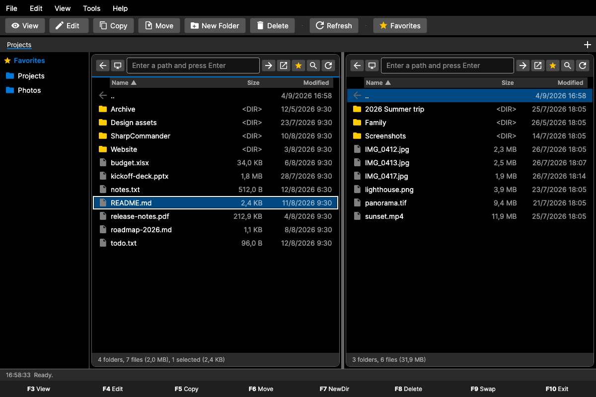

# SharpCommander

[](https://github.com/aurgo/sharpCommander/actions/workflows/ci.yml)
[](https://dotnet.microsoft.com/download/dotnet/10.0)
[](https://avaloniaui.net/)
[](https://opensource.org/licenses/MIT)
[](https://github.com/aurgo/sharpCommander/releases)

A cross-platform dual-pane file manager in the Total Commander tradition, built with Avalonia UI and .NET 10.
SharpCommander runs natively on Windows, Linux and macOS with the same keyboard-driven workflow everywhere.



The screenshot is rendered by the test project from the real main window (see [Tests](#tests)).

## Features

### Panels and navigation

- Two panels side by side, with tabs (`Ctrl+T`, `Ctrl+W`, `Ctrl+Tab`); the tab title follows the active panel's folder.
- Editable path box with a history of visited folders, parent-folder button, and a **Computer** view listing the real volumes with free and total space (pseudo file systems and system mount points are filtered out on Linux and macOS).
- Listing sorted folders first in natural order (`file2` before `file10`); click a column header or use the context menu to sort by name, size or modification date, ascending or descending. The choice is remembered.
- Hidden files (Hidden attribute, dotfiles on Unix) are hidden by default and toggled with `Ctrl+H`.
- Type-ahead selection (works with any keyboard layout) and a filter box (`Ctrl+F`).
- Panels refresh automatically when the folder changes on disk; the watcher restarts itself after an error.
- Favorites panel (`Ctrl+B`): add or remove the current folder (`Ctrl+D` or the star button), rename, reorder by drag, open in the other panel, restore the defaults.
- Sync (other panel goes to the same folder) and swap (`F9`) panels.

### File operations

- Copy (`F5`) and move (`F6`) to the other panel with byte-level progress, the current file and a **Cancel** button in the status bar. Long batches are pre-measured so the percentage covers the whole batch.
- Name clashes ask what to do: **Overwrite**, **Skip**, **Rename** or **Cancel**, with *apply to all remaining conflicts*. Overwrites replace the file atomically; moving a folder onto an existing folder merges them.
- Moving something onto its own location or a folder into itself is detected up front and reported; nothing is deleted before its replacement is complete. Moves across volumes copy and then delete file by file.
- Delete (`F8`, `Delete`, context menu) asks for confirmation and moves to the **trash** by default (Windows Recycle Bin, macOS Trash, freedesktop trash on Linux). `Shift+Delete` deletes permanently after confirmation; when the trash refuses an item, permanent deletion is offered.
- Rename (`F2`) and new folder (`F7`) validate the name inline (no separators, no invalid characters, no `.`/`..`, Windows reserved names) and refuse existing names.
- Cut, copy and paste (`Ctrl+X`, `Ctrl+C`, `Ctrl+V`) use the operating system clipboard: files copied in Finder or Explorer can be pasted, and files copied here can be pasted elsewhere. Paste after cut moves.
- Drag and drop between the panels (move, hold `Ctrl` to copy), from other applications (copy) and out to other applications.
- Per-item failures are collected and shown once in a dialog listing every failed path; the log file keeps the details.

### Tools

- **Viewer** (`F3`): read-only viewer for text files with BOM/UTF-8/Latin-1 detection, line wrap and find (`Ctrl+F`, `Enter`/`F3` for the next match); binary files are shown as a hex dump. Files larger than 16 MiB show their first 16 MiB.
- **Edit** (`F4`) and `Enter` open the entry with its default application; programs and scripts ask for confirmation first.
- **Advanced search** (`Ctrl+Shift+F`): glob patterns (`*`, `?`) or regular expressions, optional content match, recursive, cancellable; activating a result navigates the panel to it.
- **Mass rename** (`Ctrl+M`): name and extension masks (`[N]`, `[E]`, `[C]` counter with start/step/digits), search and replace (plain or regex), case changes, and a preview that flags invalid names, duplicates in the batch and existing targets before anything is renamed.
- **Checksums** (`Ctrl+Shift+H`): MD5, SHA-1, SHA-256 and SHA-512 computed in one pass with progress, cancel and copy buttons.
- **Properties** (context menu): formatted size, asynchronous folder size and counts, created/modified/accessed dates, attributes, Unix permissions and drive space.
- **Show in file manager**: Explorer, Finder or the default Linux file manager (`xdg-open`).

### Reliability

- Every command is guarded: errors are logged and shown in a dialog instead of crashing the application; global handlers cover the UI thread, unobserved tasks and the app domain.
- Settings are written atomically (temporary file plus rename), saves are debounced and flushed before the window closes; a corrupt settings file is kept as `settings.json.bak`.
- Light, dark and system themes, the favorites panel state and the window size are remembered between sessions.

## Getting started

### Prerequisites

- [.NET 10 SDK](https://dotnet.microsoft.com/download/dotnet/10.0)

### Build, run and test

```bash
git clone https://github.com/aurgo/sharpCommander.git
cd sharpCommander

dotnet build SharpCommander.sln
dotnet run --project src/SharpCommander.Desktop/SharpCommander.Desktop.csproj
dotnet test SharpCommander.sln
```

On macOS, `./run-macos.sh` builds the Debug configuration and launches it from a temporary `.app` bundle so the Dock shows the proper icon and name.

### Tests

The test project (`tests/SharpCommander.Tests`, xunit + `Avalonia.Headless.XUnit`) boots the real `App` on the headless platform and drives the actual windows with keyboard and mouse events, next to service-level tests of the file engine, settings, watcher, trash and clipboard. It runs in a few seconds on every push through [GitHub Actions](.github/workflows/ci.yml) on Ubuntu, Windows and macOS.

The README screenshot is generated by the same project:

```bash
SC_SCREENSHOT=1 dotnet test SharpCommander.sln --filter GenerateReadmeScreenshot
```

## Publishing

The publish configuration (self-contained, partially trimmed, no debug symbols) lives in `src/SharpCommander.Desktop/SharpCommander.Desktop.csproj`, so a plain `dotnet publish` and the scripts produce the same binaries. The version comes from `Directory.Build.props`, the single place where it is defined.

| Script | Platform | Notes |
|--------|----------|-------|
| `./publish.sh [rid...]` | Linux, macOS | Wraps macOS outputs in `SharpCommander.app` (ad-hoc signed when `codesign` exists) and zips the bundle |
| `.\publish.ps1 -Platform <rid>[,<rid>]` | Windows (PowerShell 5.1 or 7) | Zips the publish folder |
| `publish.bat [rid]` | Windows (cmd) | Menu when called without arguments |

All scripts accept the runtime identifiers `win-x64`, `win-x86`, `win-arm64`, `linux-x64`, `linux-arm64`, `osx-x64`, `osx-arm64` or `all`, an `--aot` / `-AOT` flag that adds `-p:PublishAot=true` (native AOT needs the platform toolchain and cannot cross-compile), and `--no-zip` / `-NoZip`. Output goes to `publish/<rid>/` and `publish/SharpCommander-v<version>-<rid>.zip`.

The equivalent manual command is:

```bash
dotnet publish src/SharpCommander.Desktop/SharpCommander.Desktop.csproj -c Release -r linux-x64 -o publish/linux-x64
```

Pushing a tag `v<version>` that matches `Directory.Build.props` makes the CI workflow publish the seven runtime identifiers and attach the archives to a GitHub release.

## Keyboard shortcuts

Shortcuts use `Ctrl` on every platform, including macOS.

| Shortcut | Action |
|----------|--------|
| `F2` | Rename |
| `F3` | View in the internal viewer |
| `F4` | Edit (open with the default application) |
| `F5` | Copy the selection to the other panel |
| `F6` | Move the selection to the other panel |
| `F7` | New folder |
| `F8` / `Delete` | Delete (to the trash by default, asks first) |
| `Shift+Delete` | Delete permanently (asks first) |
| `F9` | Swap panels |
| `F10` | Exit |
| `Ctrl+A` | Select all |
| `Ctrl+C` / `Ctrl+X` / `Ctrl+V` | Copy / cut / paste through the system clipboard |
| `Ctrl+R` | Refresh both panels |
| `Ctrl+F` | Toggle the filter box |
| `Ctrl+H` | Show or hide hidden files |
| `Ctrl+B` | Toggle the favorites panel |
| `Ctrl+D` | Add or remove the current folder in favorites |
| `Ctrl+T` / `Ctrl+W` | New tab / close tab |
| `Ctrl+Tab` / `Ctrl+Shift+Tab` | Next / previous tab |
| `Ctrl+Shift+F` | Advanced search |
| `Ctrl+M` | Mass rename |
| `Ctrl+Shift+H` | Checksums |
| `Enter` | Open the selected folder or file; in the path box, go to the typed path |
| `Backspace` | Parent folder |
| `Esc` | Clear the filter box and the type-ahead buffer |
| Typing | Type-ahead selection |

Text boxes keep their own keys: `Delete`, `Backspace` and `Ctrl+A/C/X/V` edit the text while the path or filter box has the focus.

## Settings and logs

| | Windows | Linux and macOS |
|---|---|---|
| Settings | `%APPDATA%\SharpCommander\settings.json` | `~/.config/SharpCommander/settings.json` |
| Log | `%APPDATA%\SharpCommander\logs\app.log` | `~/.config/SharpCommander/logs/app.log` |

The log rotates to `app.log.1` above 1 MiB. Settings include favorites, history, last folders, sort order, hidden-files toggle, theme, favorites panel state and window bounds.

## Architecture

```
SharpCommander.sln
├── Directory.Build.props             # Version and shared build metadata (single source of the version)
├── src/
│   ├── SharpCommander.Core/          # Models, contracts and helpers; no UI dependencies
│   │   ├── Interfaces/               # IFileSystemService, IFileOperationsService, IDialogService,
│   │   │                             # ISettingsService, ITrashService, IFileSystemWatcher
│   │   ├── Models/                   # FileSystemEntry, FileConflict, FileOperationResult, UserSettings...
│   │   └── Utilities/                # PathUtils, NaturalStringComparer
│   └── SharpCommander.Desktop/       # Avalonia application
│       ├── Services/                 # FileSystemService + FileTransferEngine, FileOperationsService,
│       │                             # TrashService, ClipboardService, SettingsService, watcher, AppLog...
│       ├── ViewModels/               # CommunityToolkit.Mvvm view models
│       ├── Views/                    # XAML windows and dialogs
│       ├── Styles/                   # Application styles
│       └── Utilities/                # Cached converters, icons, SyncedObservableCollection
├── tests/SharpCommander.Tests/       # xunit + Avalonia.Headless tests, fakes, screenshot generator
├── docs/                             # Landing page and screenshot
└── legacy/                           # The original 2009 WinForms application (kept for reference, not built)
```

The Core project defines the contracts; the Desktop project implements them and composes the object graph in `App.axaml.cs`. `IFileOperationsService` is the single entry point for copy, move, delete, rename, new folder and open, so the function keys, the clipboard, the context menu and drag and drop share the same confirmations, progress and error policy. View models never reference Avalonia controls, bindings are compiled (`x:DataType` everywhere) and the trimming/AOT analyzers are enabled with zero warnings.

### Key technologies

- **.NET 10**
- **Avalonia UI 11.3** with the Fluent theme and the `DataTransfer` clipboard/drag-and-drop API
- **CommunityToolkit.Mvvm 8.4** source generators
- **System.Text.Json** source-generated serialization (no reflection)
- **xunit** and **Avalonia.Headless.XUnit** for the tests

## Contributing

See [CONTRIBUTING.md](CONTRIBUTING.md) for the build and test commands, the code conventions and the release procedure. Bug reports and pull requests are welcome.

## License

This project is licensed under the MIT License - see the [LICENSE](LICENSE) file for details.

## Contact

AURGO - [@aurgo](https://github.com/aurgo)

Project link: [https://github.com/aurgo/sharpCommander](https://github.com/aurgo/sharpCommander)
